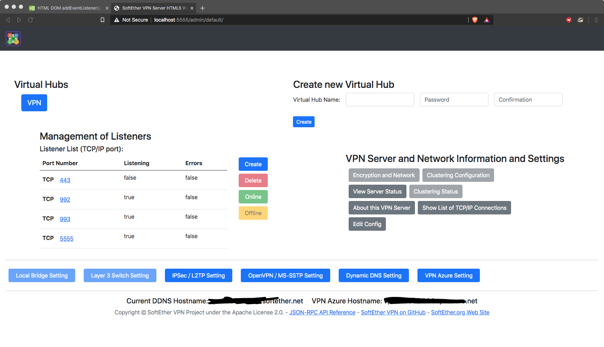
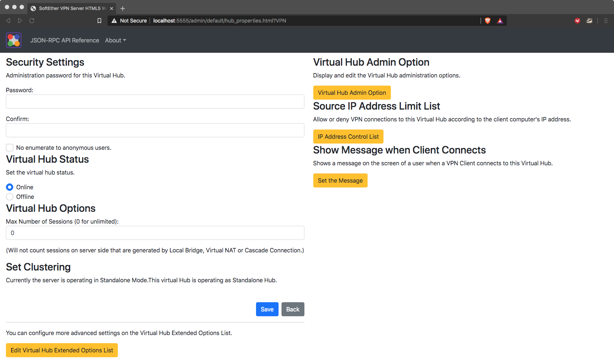

# SotEtherVPN HTML5-based Admin Console


### Notes
  - *Buttons not yet implemented are disabled, but not all disabled buttons are not implemented*
  - Built using [Bootstrap (v.5.0.0-beta1)](https://github.com/twbs/bootstrap) and [SoftEther VPN Server JSON-RPC Document on GitHub](https://github.com/SoftEtherVPN/SoftEtherVPN/tree/master/developer_tools/vpnserver-jsonrpc-clients/)
  - This project is based on the original HTML5-based Modern Admin Console and JSON-RPC API Suite found [here](https://github.com/SoftEtherVPN/SoftEtherVPN/tree/master/src/bin/hamcore/wwwroot/admin)
  - There is a bug in IPv6 Acess List Rules using the API(s) calls.
## Progress
  - [x] Hub Properties
  - [x] Hub Status
  - [x] Delete Hub
  - [x] Online/offline
  - [x] View Server Status
  - [x] About This VPN
  - [x] Show List of TCP/IP Connections
  - [x] Management of Listeners
  - [ ] Deletion popup
  - [ ] **Manage Virtual Hub**
    - [x] Status
    - [x] Manage Access Lists (there are issues, plus it can be improved)
    - [ ] Manage Users (bugs)
    - [ ] Manage Groups
    - [x] RADIUS
    - [ ] Cascade Connections
    - [ ] Logs
    - [ ] CA
    - [ ] Secure NAT
    - [ ] Manage Sessions
  - [ ] Encryption and network
  - [ ] Clustering Configuration
  - [x] **Edit Config**
  - [x] Local Bridge Setting (if the system allows it)
  - [ ] Layer 3 Switch
  - [x] IPsec / L2TP Setting
  - [x] OpenVPN/MS-SSTP Setting
  - [x] Dynamic DNS Setting
  - [x] VPN Azure Setting
  - [ ] Disable unecessary items if logged in as a Hub Admin
  - [ ] Implement a function that translates 0.0.0.0 to /0 (-ish)
  - [ ] improve readability of dates
#### Post-checklist
  - [ ] Work on the graphical aspects
## Trying the web UI with Docker
I built a docker image that allows everyone to test the Web UI without compiling from source the code. Although it is not possible to use the local bridge function inside the container other functions are testable.

To run the container: ```docker run -itd -p 5555:5555 --name <container_name> --cap-add=NET_ADMIN --device /dev/net/tun leuca/sevpn-web-console```and after it's ready go to https://localhost:5555/admin

Youl'll get a warning saying that the site is not secure. That's due to the fact that the certificate is self-signed and it's correct that way.

You can also see how I made the docker image here: https://github.com/Leuca/SoftEther-VPN-Web-Console-Docker
## Installing the web UI
It is possible to try this UI by copying the ```wwwroot``` folder into a previously cloned SoftEtherVPN source code and by compliling it.<br>
In a UNIX environment should be something like this:
```bash
git clone https://github.com/Leuca/SEVPN-WebAdmin.git
git clone https://github.com/SoftEtherVPN/SoftEtherVPN_Stable.git
cp -r SotEtherVPN-Web-UI/wwwroot/admin/default/ SoftEtherVPN_Stable/src/bin/hamcore/wwwroot/admin
cd SoftEtherVPN_Stable
./configure
make
sudo make install
```

or like this:

```bash
git clone https://github.com/Leuca/SEVPN-WebAdmin.git
git clone https://github.com/SoftEtherVPN/SoftEtherVPN.git
cp -r SotEtherVPN-Web-UI/wwwroot/admin/default/ SoftEtherVPN/src/bin/hamcore/wwwroot/admin
cd SoftEtherVPN
git submodule init && git submodule update
./configure
make -C tmp
sudo make -C tmp install
```
Further details on how to compile SoftEtherVPN Software can be found either at [BUILD UNIX](https://github.com/SoftEtherVPN/SoftEtherVPN/blob/master/src/BUILD_UNIX.md) or at [BUILD WINDOWS](https://github.com/SoftEtherVPN/SoftEtherVPN/blob/master/src/BUILD_WINDOWS.md) for Unstable Version.
Building the Stable version is described as following:
"
HOW TO GET THE LATEST SOURCE CODE TREE FOR DEVELOPERS

If you are an open-source developer, visit our GitHub repository:
https://github.com/SoftEtherVPN/SoftEtherVPN_Stable/

You can download the up-to-date source-code tree of SoftEther VPN
from GitHub. You may make your own fork project from our project.

The download and build instruction is following:
```bash
git clone https://github.com/SoftEtherVPN/SoftEtherVPN_Stable.git
cd SoftEtherVPN
./configure
make
make install
```
"
