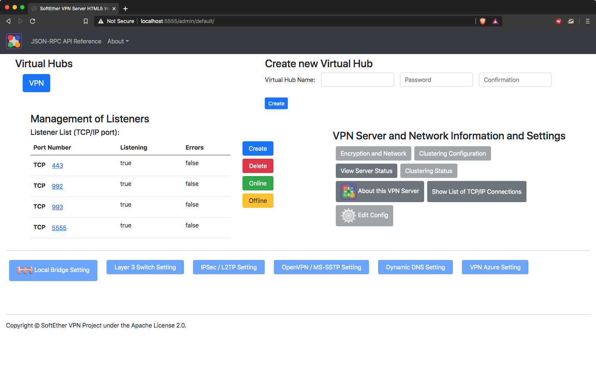

# SotEtherVPN HTML5-based Admin Console


### Notes
  - *Buttons not yet implemented are disabled*
  - Built using [Bootstrap (v.5.0.0-alpha1)](https://github.com/twbs/bootstrap) and [SoftEther VPN Server JSON-RPC Document on GitHub](https://github.com/SoftEtherVPN/SoftEtherVPN/tree/master/developer_tools/vpnserver-jsonrpc-clients/)
  - This project is based on the original HTML5-based Modern Admin Console and JSON-RPC API Suite found [here](https://github.com/SoftEtherVPN/SoftEtherVPN/tree/master/src/bin/hamcore/wwwroot/admin)
## Progress
  - [x] Hub Properties
  - [x] Hub Status
  - [x] Delete Hub
  - [x] Online/offline
  - [x] View Server Status
  - [x] About This VPN
  - [x] Show List of TCP/IP Connections
  - [x] Management of Listeners
  - [ ] Deletion popup
  - [ ] **Manage Virtual Hub**
    - [x] Status
    - [x] Manage Access Lists (there are issues, plus it can be improved)
    - [ ] Manage Users
    - [ ] Manage Groups
    - [ ] RADIUS
    - [ ] Cascade Connections
    - [ ] Logs
    - [ ] CA
    - [ ] Secure NAT
    - [ ] Manage Sessions
  - [ ] Encryption and network
  - [ ] Clustering Configuration
  - [ ] Edit Config
  - [ ] Local Bridge Setting
  - [ ] Layer 3 Switch
  - [ ] IPsec / L2TP Setting
  - [ ] OpenVPN/MS-SSTP Setting
  - [ ] Dynamic DNS Setting
  - [ ] VPN Azure Setting
  - [ ] Disable unecessary items if logged in as a Hub Admin
  - [ ] Implement a function that translates 0.0.0.0 to /0 (-ish)
## Installing the web UI
It is possible to try this UI by copying the ```wwwroot``` folder into a previously cloned SoftEtherVPN source code and by compliling it.<br>
In a UNIX environment should be something like this:
```bash
git clone https://github.com/Leuca/SEVPN-WebAdmin.git
git clone https://github.com/SoftEtherVPN/SoftEtherVPN_Stable.git
cp -r SotEtherVPN-Web-UI/wwwroot/admin/default/ SoftEtherVPN_Stable/src/bin/hamcore/wwwroot/admin
cd SoftEtherVPN_Stable
./configure
make
sudo make install
```

or like this:

```bash
git clone https://github.com/Leuca/SEVPN-WebAdmin.git
git clone https://github.com/SoftEtherVPN/SoftEtherVPN.git
cp -r SotEtherVPN-Web-UI/wwwroot/admin/default/ SoftEtherVPN/src/bin/hamcore/wwwroot/admin
cd SoftEtherVPN
git submodule init && git submodule update
./configure
make -C tmp
sudo make -C tmp install
```
